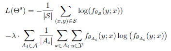
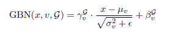
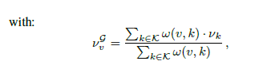

# AdaGraph

## Introduction
predictive transfer learning：target domain既没有label也没有data，但是有labeled source domain和有data无label的辅助domain，以及各个domain的metadata

- 共同的基石网络嵌入到不同的领域具体模型中
- 利用metadata和辅助样本构建图，显示描绘domain之间的依赖关系，依赖关系由metadata决定
- 当target数据流不断流入时持续更新网络参数
## Related works

## Method
一些记号
- $\mathcal{K}=\mathcal{S}\cup\mathcal{A}$: known domains, all have data and metadata, $\mathcal{S}$ have label, $\mathcal{A}$ only have data. $\mathcal{T}$ target domain, no data and label, only metadata. $\mathcal{Y}$: set of all classes.

整个过程分为3步：
- 利用metadata连接不同domain形成一个图
- 训练domain specific model
- 利用利用domain图推测target domain上模型的参数

详情：
Step 1：connecting domains through a graph
设domain空间为$\mathcal{D}$，metadata空间为$\mathcal{M}$, 存在一个双射$\phi:\mathcal{D}\rightarrow\mathcal{M}$联系domain与metadata。构建一个domain图，结点为$\mathcal{K}$中的domain，边为两个domain的相似性，由其metadata的相似性度量，定义为：$w(v_1,v_2)=e^{-d(\phi(v_1),\phi(v_2))}$。

设$\Theta$是模型参数空间，并假设我们已经正确的学到了domain specific的模型，可以定义映射$\psi:\mathcal{K}\rightarrow\Theta$，从而$\psi o \phi^{-1}$是metadata到模型参数的映射。利用domain图（实际上是metadata图）和参数的关系，我们可以这样估计target domain的参数

$\hat{\theta}_{\mathcal{T}}=\psi(\mathcal{T})=\frac{\Sigma_{(\mathcal{T},v)\in \mathcal{E}}w(\mathcal{T},v)\psi(v)}{\Sigma_{(\mathcal{T},v)\in\mathcal{E}}w(\mathcal{T},v)}$

在没有metadata的情况下，可以设定
$\hat{\theta}_x=\Sigma_{v\in\mathcal{V}}p(v|x)\psi(v)$

$p(v|x)$为给定输入x条件下x属于domain v的概率，他可以由训练一个domain分类器得到
Step2: Extracting node specific model
使用domain specif batch-normalization layers（DABN）来做传统的DA（应对那些没有label的domain）。前端的层用于抽取有用统计特征，高层的统计特征只是均值和方差不同，分布是相同的。给定domain k，DABN层是
$DA_{BN}(x,k)=\gamma\frac{x-\mu_k}{\sqrt{\sigma_k^2+\epsilon}}+\beta$

$\gamma,\beta$是可以学习的全局scale和basis参数。

本文中，令$\psi(k)=\theta_k=\{\theta^{\alpha},\theta^s_k\}$, $\theta^{\alpha}$是全局的共同参数，代表各domain之间的共性（卷积与全链接层），$\theta^s_k$则是domain specific的（DABN层）。利用GraphBN来代替原始的BN，GraphBN定义为：
$GBN(x,v)=\gamma_v\frac{x-\mu_v}{\sqrt{\sigma^2_v+\epsilon}}+\beta_v$
其中$\mu_v=\frac{1}{|\mathcal{B}_v|}\Sigma_{x\in\mathcal{B}_v}x,\sigma^2_v=\frac{1}{|\mathcal{B}_v|}\Sigma_{x\in\mathcal{B}_v}(x-\mu_v)^2$称这一层GBN的统计量, $\mathcal{B}_v$是当前batch中属于domain v的元素的集合。domain specific的basis与scale参数通过loss函数来优化，loss函数定义为：

第一项为在有标签domain上的交叉熵，第二项为在辅助domain上的熵。

这里的domain specific参数实际上就是basis和scale参数，为了把图的信息引入到训练过程中，进一步修改GBN为：

## Continuous domain adaptation
在测试时，target data会逐步的流入，可以运用这些target数据流进一步调整模型。这里采取更新BN统计量的方式来达成这一点。

假设我们在内存中一次存储最近的M个测试样本，并用他们对target域的GBN统计量进行局部的估计（其实就是计算target domain的$\mu_{\mathcal{T}},\sigma_{\mathcal{T}}$)。同时我们用这些数据，计算一个M上的熵函数，用以微调target域上的scale与basis参数
问题：在test数据一个一个的传过来（而非一个batch一个batch），并且要求每个传来时立刻给出回复时，如何决定GBN的统计量？
