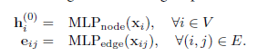
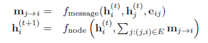
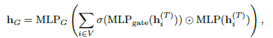
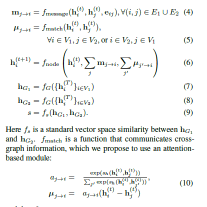

# Graph Matching Networks for Learning the Similarity of Graph Structured Objects
@(GCN)
## Info
|Author(First)|Conference/Journal|Paper Citations|First Author Citations|Organizations|
|:------------:|:----------:|:-------:|:--:|:--:|
|Yujia Li|ICML2019|No info|1426|DeepMind|

## Summary
### Deep Graph Similarity learning
This paper propose two kinds of models for Graph similarity learning
- Graph Embedding model: Embed graphs into a vector space and build a similarity metric on that space
- Graph Matching model: Applying neural network to compute the similarity scores directly.

#### Graph Embedding model
Consists of three components:
- Encoder: two separated MLP to initialize the node representations
 

- Propagation layers: a graph-LSTM(based on MPNN) to further process the node representations
 

- Aggregator: aggregate the info. from all node representations and produce the graph-level representations. The original idea comes from GraphSage.
 

After getting the graph-level representations, a similarity metric, such as Euclidean,cosine or Hamming, is applied to compute the similarity among graphs

#### Graph Matching Network
This network applies simple insight and great parameter volume to capture the similarity between graphs. **The High Templar** thinks that this method only works in specific domains and may be the by-product of huge amount of parameter tuning, which is hard for reproduction. (The research of graph matching and graph similarity metric has gone on for a long history in math community.)

