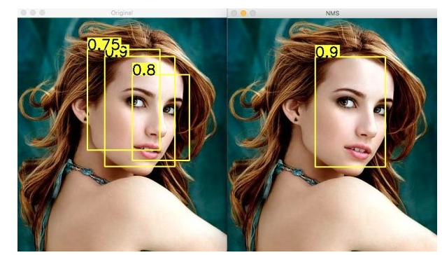
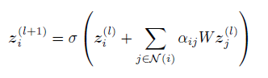
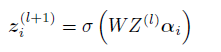
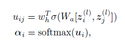
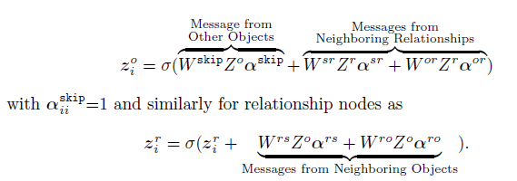
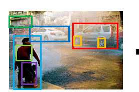
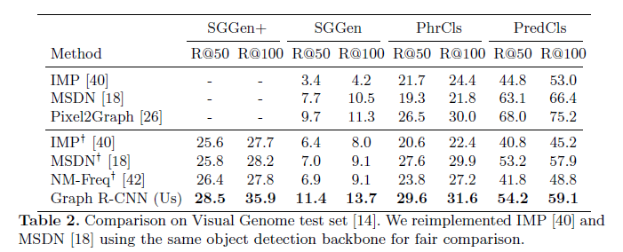

# Graph R-CNN for Scene Graph Generation
@(GCN)
## Info
|Author(First)|Conference/Journal|Paper Citations|First Author Citations|Organizations|
|:------------:|:----------:|:-------:|:--:|:--:|
|Jiawei Yang|ECCV2018|26|1170|Georgia Institute of Technology|

## Summarize
### Model
模型分为三个部分:
- 目标结点抽取：Fast R-CNN抽取出n个object proposals，第i个object proposals由位置$r_i^o=[x_i,y_i,w_i,h_i]$，特征$x_i^o$，预测标签$p_i^o$构成，这全体object proposal构成三个变量矩阵：$R^o\in\mathbb{R}^{n\times 4},X^o\in\mathbb{R}^{n\times d},P^o\in\mathbb{R}^{n\times|C|}$
- 关系剪枝： RePN：relation proposal net，计算relatedness scores of object pairs。本文认为object的class label对object关系的强烈程度有指导作用（在有强烈偏置的小数据集中是这样），relatedness score计算方法为$s_{ij} = sigmod(\langle\Phi(p_i^o),\Psi(p_j^o)\rangle)$，之后选出top-K组关系，再对这K组关系使用非极大抑制（NMS）消除重叠和冗余，得到最终的关系（Note：NMS，以目标检测为例：目标检测的过程中在同一目标的位置上会产生大量的候选框，这些候选框相互之间可能会有重叠，此时我们需要利用非极大值抑制找到最佳的目标边界框，消除冗余的边界框。Demo如下图：
左图是人脸检测的候选框结果，每个边界框有一个置信度得分(confidence score)，如果不使用非极大值抑制，就会有多个候选框出现。右图是使用非极大值抑制之后的结果，符合我们人脸检测的预期结果。）。从存在relationship的两个object的特征中，可以抽取出关系的特征表示$X^r=\{x_1^r,...,x_m^r\}$
- graph内容整合： aGCN：attentional GCN，汇聚图中的高阶信息。
 - 本文使用的是Kipf的1stChebNet，并利用attention对邻接矩阵的权值进行了调整，原始的GCN为
 
  $a_i\in[0,1]^n$是重规范后的邻接矩阵，$a_{ii}=1,a_{ij}=0$则表示i和j不相邻，因为权值相当于手工提取的特征，未必能很好的与神经网络契合，这里使用attention对权值进行调整，方法如下
  
注意，这里仍然维持了$a_{ii}=1,a_{ij}=0$则表示i和j不相邻的特性，在原始GCN中，这是为了训练过程的稳定性所必要的。

 - 本文的场景图的结点中既有object，又有relationship。在场景图中，所有的object都直接相连（称为skip connections），relationship则与其对应的object与subject相连，图中出现三种不同的connections：object ↔ relationship, relationship ↔ subject and object ↔ object。以如下的方式更新结点信息

Loss function：以上的每一个步骤都单独的训练，使用不同的监督损失函数。
- 目标结点抽取：same loss as used in RPN, which consists of a binary cross entropy loss on proposals and a regression loss for anchors.
- 关系剪枝：another binary cross entropy loss on the relation proposals.
- graph内容整合：two multi-class cross entropy losses are used for object classification and predicate classification.

 
### Metric
 提出了一个衡量scene graph generation质量的测度SGGen+：
 以往的测度往往基于<subject,predicate,object>三元组（triplet entries）的召回率，或给定ground truth object位置以后的object，predicate召回率，这样的方法对复杂问题的小错误过于敏感，如：
 
如过场景图将图中boy误认为man，而其他关系全部识别正确，该场景图的三元组召回率将会很低。
为了解此问题，本文计算所有单个entity，pair entries，triplet entries的总召回率。

### Experiment
在修改后的数据集Visual Genome上，于各种测度下都大幅超越了**作者所复现的**以往的方法，修改方法来自CVPR2017 Scene Graph Generation by Iterative Message Passing

