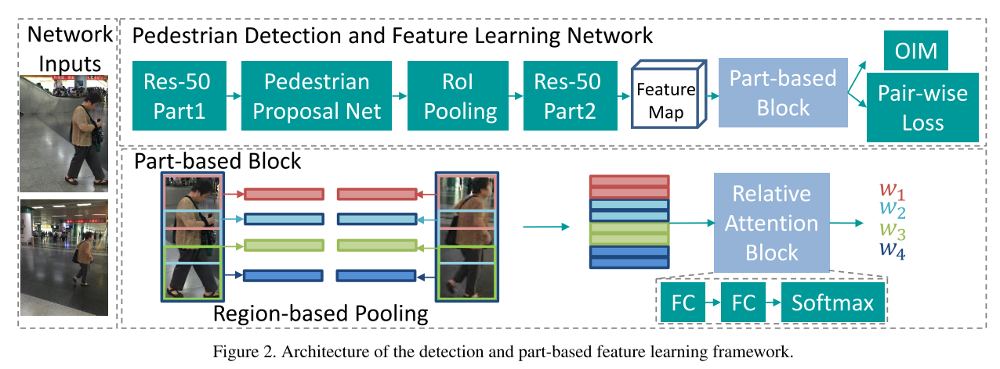

# Learning Context Graph for Person Search
## Authors
Yichao Yan
Qiang Zhang
Bingbing Ni
Wendong Zhang
Minghao Xu
Xiaokang Yang  
1Shanghai Jiao Tong University, China
2MoE Key Lab of Artificial Intelligence, AI Institute, Shanghai Jiao Tong University, China 3 Tencent YouTu Lab, China
4 Inception Institute of Artificial Intelligence, UAE

## Task&Motivation&Contribution
### Task
person search（pedestrian detection and person re-identification）  
即同时检测行人框并识别框中行人ID
### Motivation
Co-travelers captured by the same camera will have high chance to be also captured by its neighboring cameras. Employing context/group information is a promising direction to tackle real-world person re-identification.  
在一个摄像头下拍摄到的同行者有很大概率在邻近摄像头也一起出现。

### Contribution
1）We introduce a multi-part learning scheme into person search, which supports end-to-end human detection and multi-part feature learning.  
提出了一个multi-part learning方法  
2）We introduce a relative attention model to adaptively select informative context the scene.  
提出了一个relative attention model来提取场景信息  
3）We build a graph to learn global similarity between two individuals considering context information.  
提出了一个通过构建图学习考虑了环境信息的行人间相似度的方法   

## Network

Therefore, our core idea is to expand instance features such that context information can be used to learn better representation.  

核心思想即通过环境信息学习更好的特征。

包括三个steps：

1）Instance Detection and Feature Learning.   

In this stage, we utilize a baseline CNN to perform joint detection and feature learning on person search datasets.  

第一步通过baseline CNN进行检测和特征学习。

we employ ResNet-50 as stem, which is divided into two parts. The first part (conv1 to conv4 3) outputs 1024 channel feature maps, which have 1/16 resolutions of the input image. Following Faster R-CNN framework, a pedestrian proposal network(PPN) is built on top of these feature maps to generate person proposals. All the candidate proposals are fed into a RoI-Pooling layer to generate feature representations for each bounding box. These features are then convolved by the second part of ResNet50 (conv4 4 to conv5 3). These features are then connected to an average pooling layer to generate 2048-dimensional feature representation. The pooled features are connected with two fully connected (Fc) layers. The first branch is a binary Softmax layer which is trained to make person/non-person judgments. The second branch is a 256-dimensional Fc layer, whose outputs are further L-2 normalized as feature representation for inference.  

其中检测部分网络采用ResNet-50作为baseline，并分为两个部分。第一部分提出候选框，第二部分判断候选框是否是行人，并提取特征。

The identities appeared in each mini-batch are highly sparse, which makes Softmax loss training even harder. To address this issue, previous methods design several online learning loss. In this work, we adopt online instance matching (OIM) loss [42] to supervise feature learning for each part.

值得一提的是，本文采用了 online instance matching (OIM) loss 去学习每块的特征。

2）Contextual Instance Expansion  

This stage expands instance feature with context information for better representation.  

第二步对目标引入上下文信息  

For all the context pairs, we select the top K matched pairs as positive contexts, which are utilized for further feature learning.  

3） Contextual Graph Representation Learning  

Given a probe-gallery pair, we construct a graph to measure the similarity of target pair.  

构建图来衡量probe-gallery间的相似程度。

利用场景中其他匹配对的信息对其进行更新。  

## Experiment

展示了attention和graph的作用