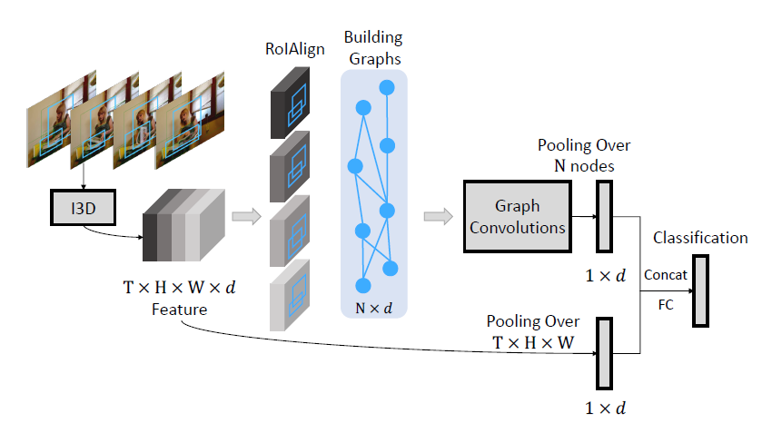
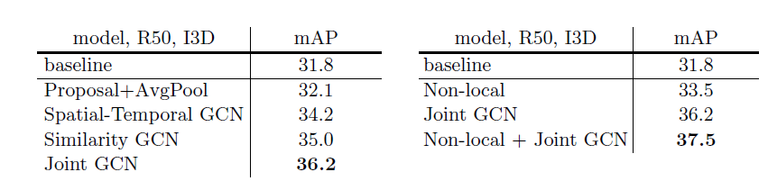
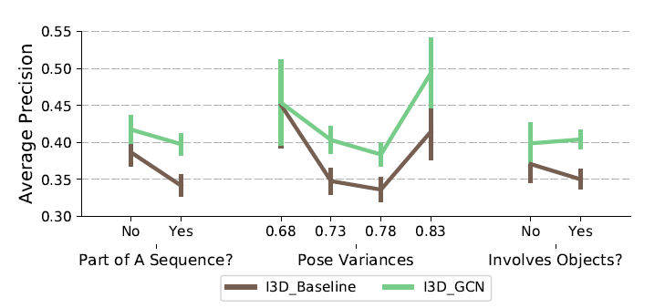

# Videos as Space-Time Region Graphs
|Author(First)|Conference/Journal|Paper Citations|First Author Citations|Organizations|
|:------------:|:----------:|:-------:|:--:|:--:|
|Xiaolong Wang|ECCV2018|30|1922|Robotics Institute,CMU|

## Summary
How human recognize videos? Ex. Video: opening a book
- Modeling temporal shape dynamics, Ex. The change of shape of book over time
- Modeling functional relationships among objects, Ex. The interaction between human and book

Current methods struggle on video recognition, why? Ex. SOTA two-stream ConvNets
- methods are based on individual frame features, no temporal denpendences
- some methods use RNN to encode long term information over time, but fail to capture region-based relations over time
- some methods model human-object or object-object interactions statically inside frame, with no temporal information.

Whats new in this paper?
- represent input as space-time region graph, i.e.
 - nodes are regions connected by **appearance similarity** and **overlap in space and time**
 - apply GCN to this graph to conduct reasoning on behave of spatial-temporal relations

- significant improvements(claimed by the author) in action recognition in complex environments

### Methods
The pipeline can divided as follows:
- preprocess:  send videos to a 3D-CNN to obtain a $T\times H\times W\times d$ representations, $T$ represent time, $H,W$ represent height and width, $d$ is the channel number or pixel feature dimension
- construct graphs:
 - node proposal: RPN(region proposal network) to extract object bounding box, and RoIAlign to extract $d$-dimensional features for region proposals on behave of bounding box. Let we have $N$ proposals, then we get a $N\times d$ feature.
 - relation construction: aggregations are based on two kinds of relations, appearance similarity and overlap in space and time, so we construct two graphs connected by such two kinds of relations correspondingly with the same nodes from node proposal.
   -- appearance similarity weight: given node proposal $x_i,x_j$, the weight of edge $i->j$ is $F(x_i,x_j)=softmax((wx_i)^T(w'x_j))$
   -- overlap weight: using intersections over unions(IoUs), $G^{front}_{ij}$ stands for the normalized IoUs between object i in frame t and object j in frame t+1, $G^{back}_{ji}$ inversely.

- GCN: apply 1stChebnet: $Z=GXW$, G is renomalized adjacent matrix,W is the parameter, with the modifications below
 - adding Non-local Net(CVPR2018): adding a convolution operator(denoted as g) to the first layer of GCN, i.e. $X=g(X)$
 - adding residual connections in each layer of GCN, the final formulation: $Z=Gg(X)W+g(X)$

- combining appearance and overlap graphs: $Z=\sum_i G_i g_i(X)W_i + g_i(X)$, i is the index for graphs $G^{sim},G^{front},G^{back}$ (However, the author reported that the combination of the three graphs is less efficient than applying only similarity graph. They claim that comes from the hand crafted parameters of IoUs not consistent with learnable parameters in similarity graph, thus in practical implementation, they divide this two kinds of graphs apart and join their representations only in the last layer.)
- video classification: perform average pooling to the processed GCN features and overall video features, then concatenate them to obtain the final representations to conduct video classifications.

 

## Experiments

This paper offers vivid analysis about experiments, we will cover this part another day to offer a full through survey about video recognitions.